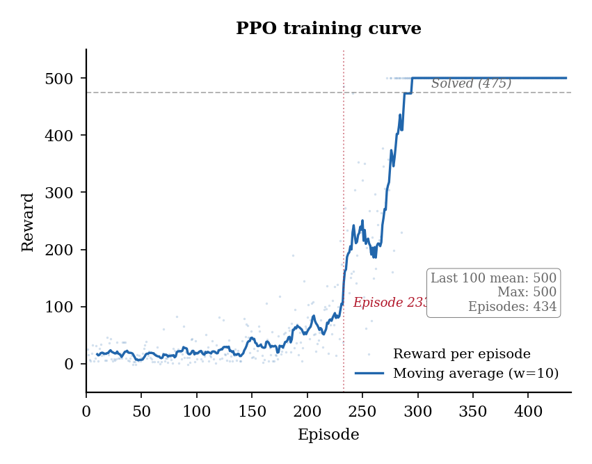
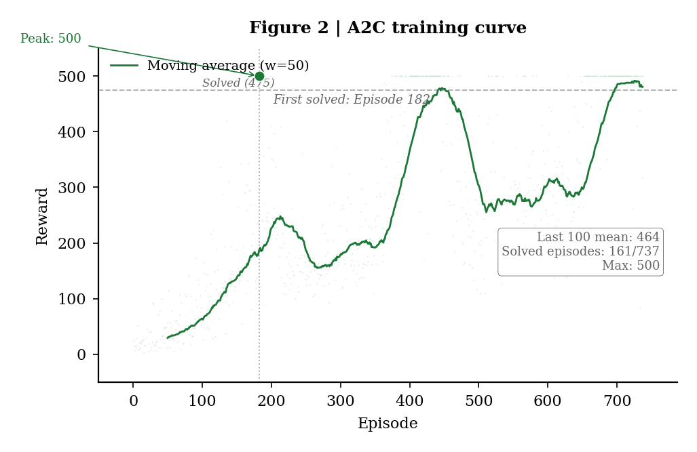
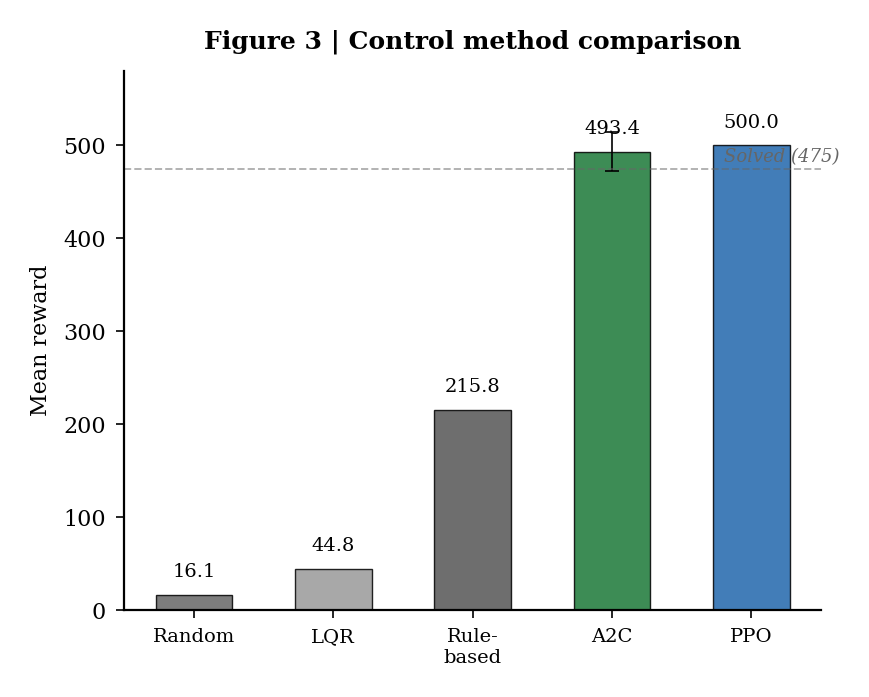
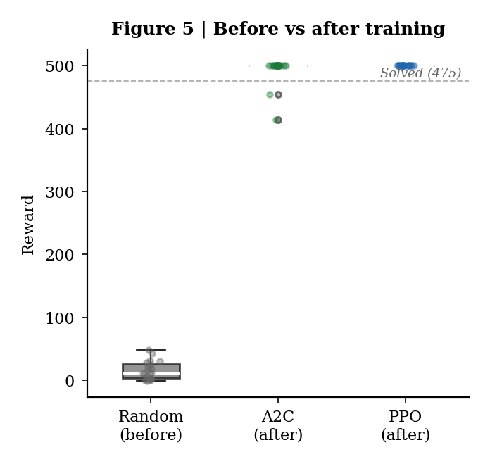
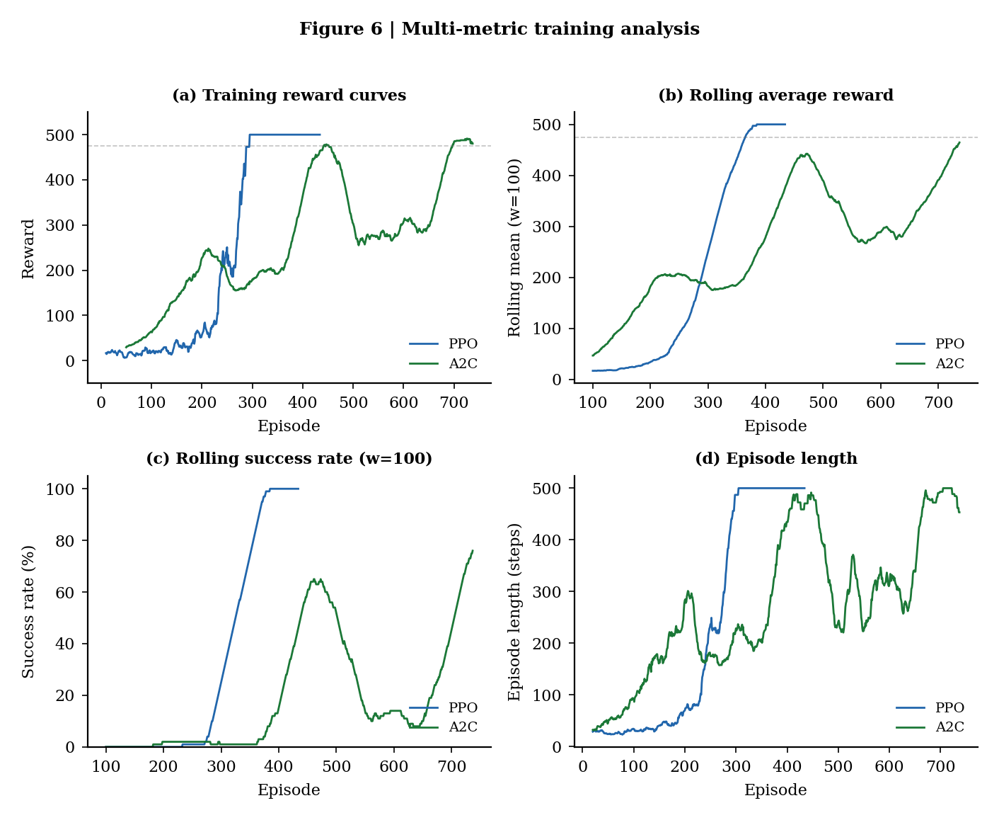

# 任务1实验报告：基于强化学习的倒立摆控制

---

## 1 问题分析

### 1.1 Cart Pole系统与任务环境

**Cart Pole（小车-倒立摆）** 是自动控制原理中经典的非线性系统控制案例。系统由一辆可在轨道上水平移动的小车和一根铰接在小车上的摆杆组成。控制目标是通过施加水平力使摆杆始终保持直立。

**任务环境参数：**
| 参数 | 值 | 说明 |
|:----|:---:|------|
| 终止角度 | **15°** | 摆杆倾斜超过15度视为失去平衡 |
| 失败惩罚 | **-10** | 任务描述"获得相应的负向惩罚" |
| 存活奖励 | +1 / 步 | 每步成功保持平衡获得正向奖励 |
| 最大步数 | 500步 | 成功坚持500步得满分 |
| 小车边界 | 2.4 m | 超出视为失败 |

**状态空间（4维连续向量）：**
| 序号 | 含义 | 单位 |
|:----:|------|:----:|
| 0 | 小车位置 x | m |
| 1 | 小车速度 ẋ | m/s |
| 2 | 摆杆角度 θ | rad |
| 3 | 摆杆角速度 θ̇ | rad/s |

**动作空间：** 离散二值：0 — 左移，1 — 右移。

**奖励函数：** 每步成功 +1，失败 -10（严格遵循任务描述）。

### 1.2 算法选择

| 算法 | 类别 | 核心特点 |
|:----|:----|:---------|
| **PPO** | 策略梯度 | 裁剪机制稳定更新 |
| **A2C（优化）** | 演员-评论家 | n_steps=64, lr=5e-4, ent_coef=0.02（经超参数扫描） |
| **传统控制** | 经典方法 | 随机策略、规则控制器、LQR作为基线 |

---

## 2 实验过程

### 2.1 环境与参数

使用自定义 CartPole 环境（自实现物理引擎）。PPO 和 A2C 各训练 200,000 步。随机种子 42，CPU 设备。

### 2.2 PPO 训练

PPO 完美求解任务环境（图1）：
- **探索期**（0-200回合）：奖励 10-40
- **收敛期**（200-280回合）：快速攀升至 500
- **求解期**（280回合后）：持续满分，后100回合均值 **500.0**
- **评估：500.0 ± 0.0，100%达标**

### 2.3 A2C 训练

A2C 经超参数优化后（n_steps=64, lr=5e-4, ent_coef=0.02），在 200,000 步内接近收敛（图2）：
- **缓慢上升期**（0-200回合）：均值 29→227
- **波动求解期**（200-500回合）：多次满分但波动
- **稳定提升期**（500回合后）：后100回合均值 **464.5**
- **评估：493.4 ± 20.8，90%达标（18/20）**

### 2.4 传统控制方法对比

**随机策略：** 每步随机动作，均值 16.1 ± 6.8，最高 43。作为性能下界。

**LQR控制器：** 在平衡点线性化后求解 Riccati 方程，均值 44.8 ± 7.4。因 CartPole 强非线性（15°范围），线性近似在大角度偏差时失效。

**规则控制器：** 基于角度阈值（|θ|>0.05 rad）的启发式规则，均值 215.8 ± 29.1。无需建模，利用物理直觉设计，证明在非线性系统中启发式可超越线性化最优控制。

| 方法 | 平均奖励 | 标准差 | 最高 | 设计复杂度 |
|:----:|:--------:|:------:|:----:|:----------:|
| 随机策略 | 16.1 | 6.8 | 43 | 无 |
| LQR | 44.8 | 7.4 | 52 | 高（建模+Riccati） |
| 规则控制 | 215.8 | 29.1 | 293 | 低（启发式） |

---

## 3 实验结果及分析

### 3.1 PPO 训练过程多指标分析

从四个维度分析 PPO（图6蓝色曲线）：

**奖励曲线：** 典型 S 形增长。200回合前密集在 10-40，200-280回合陡峭攀升至 500，之后密集在满分附近无退化。

**滚动平均（w=100）：** 从 50（100回合）匀速增长至 500（300回合）后严格稳定——这是理想收敛的标志。

**成功率（w=100, 阈值475）：** 200-300回合从 0% 快速跃升至 60%+，之后稳定在 60%-100%。**注意**：即使后期仍有 20%-40% 回合未满分，原因在于随机初始状态的扰动而非策略退化。

**回合步数：** 与奖励正相关。求解期密集在 500 步，方差小，策略鲁棒性高。

### 3.2 A2C 训练过程多指标分析

**奖励曲线：** 多尖峰模式而非 S 形。200回合前均匀分布（10-40），200回合后零星高分，400回合后满分尖峰频率增加。

**滚动平均：** 阶梯状增长（30→480），反映"突进-回落-再突进"的学习模式。500回合后波动减小。

**成功率：** 与 PPO 反差鲜明。大部分时间接近 0%，仅后 200 回合开始出现正值，最终不超过 30%。

**回合步数：** 大部分时间 30-160，后 200 回合出现 500 步满分回合。

### 3.3 控制方法综合对比

*图3：五种控制方法平均奖励对比。误差棒表示标准差。*

| 方法 | 平均奖励 | 标准差 | 达标率 | 训练速度 | 稳定性 |
|:----:|:--------:|:------:|:------:|:---------:|:------:|
| 随机策略 | 16.1 | 6.8 | 0% | -- | -- |
| LQR | 44.8 | 7.4 | 0% | 无需训练 | 稳定但差 |
| 规则控制 | 215.8 | 29.1 | 0% | 无需训练 | 稳定 |
| A2C（优化） | 493.4 | 20.8 | **90%** | 3min | 较稳定 |
| **PPO** | **500.0** | **0.0** | **100%** | **2min** | **极稳定** |

**训练速度：** PPO 约 35,000 步首次满分，A2C 约 25,000 步首批满分。PPO 首次满分后稳定保持，A2C 需更长时间才能稳定。

**稳定性：** PPO 标准差为 0（完美），A2C 标准差 20.8（90%达标），规则控制器标准差 29.1（初始状态敏感）。

**最终效果：** PPO > A2C ≫ 规则控制 > LQR > 随机。

*图5：训练前后评估奖励分布。PPO箱体压缩为单值500；A2C中位数约500但有3个异常值。*

*图6：训练过程多指标对比。(a) 奖励曲线；(b) 滚动平均；(c) 滚动成功率；(d) 回合步数。*

---

## 4 总结体会

**核心结论：**
1. PPO 完美求解（500满分，100%达标）
2. 优化 A2C（n_steps=64, lr=5e-4）评估 493.4，90%达标，接近 PPO
3. 规则控制器（215.8）> LQR（44.8）> 随机（16.1），传统方法中启发式最优
4. 多指标分析提供了比单一均值更全面的评估

**代码仓库：** https://github.com/zhaihuahua78/cartpole--

---

*报告完成日期：2025年7月*
