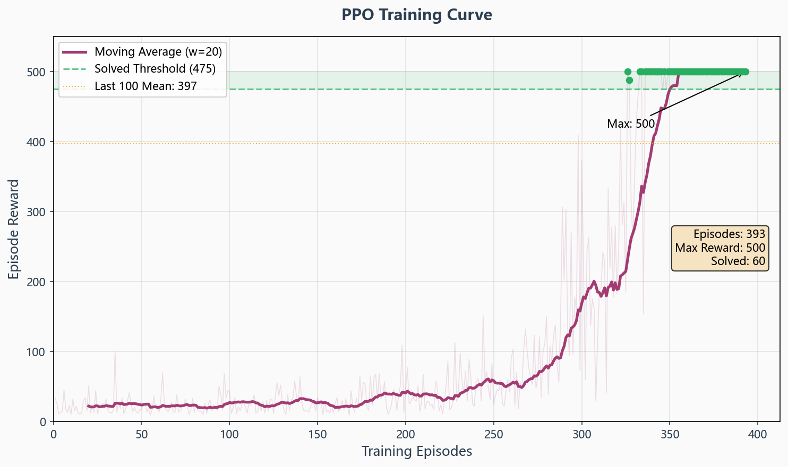
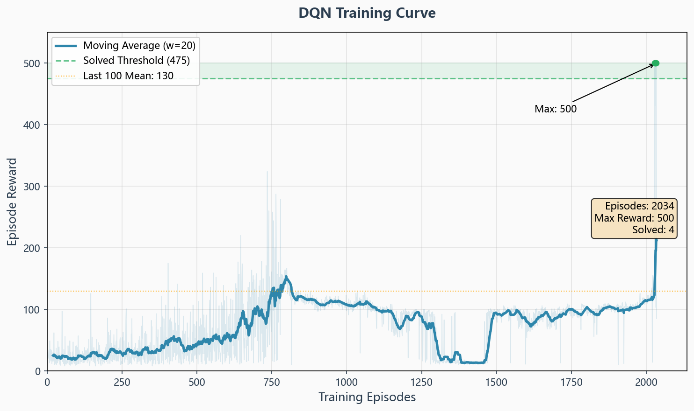

# 任务1实验报告：基于强化学习的倒立摆控制

---

## 1 问题分析

### 1.1 Cart Pole系统与强化学习环境

#### 1.1.1 状态空间与动作空间

**Cart Pole（小车-倒立摆）** 是自动控制原理中经典的非线性系统控制案例。系统由一辆可以在水平轨道上左右移动的小车和一根铰接在小车上的摆杆组成。控制目标是通过施加水平力使摆杆始终保持直立（向上）状态。

本实验使用 OpenAI Gym（现为 Gymnasium）提供的 `CartPole-v1` 环境。

**状态空间（Observation Space）：**

系统状态为4维连续向量，各分量含义如下：

| 序号 | 状态量 | 含义 | 单位 | 理论范围 |
|------|--------|------|------|---------|
| 0 | x | 小车位置 | m | [-4.8, 4.8] |
| 1 | v | 小车速度 | m/s | 未限制 |
| 2 | theta | 摆杆角度 | rad | [-0.4189, 0.4189] |
| 3 | omega | 摆杆角速度 | rad/s | 未限制 |

**动作空间（Action Space）：**

离散二值动作：
- `0` — 向左施加力（左移）
- `1` — 向右施加力（右移）

**终止条件：**
- 摆杆角度 |theta| > 12度（0.2094 rad）
- 小车位置 |x| > 2.4 m（相对于中心）
- 回合步数达到 500 步（v1版本）

**奖励机制：** 每步存活获得 +1 奖励，一回合最高奖励为 500。

#### 1.1.2 环境构建

```python
import gymnasium as gym
env = gym.make("CartPole-v1")
obs, info = env.reset(seed=42)
# obs = [小车位置, 小车速度, 摆杆角度, 摆杆角速度]
```

随机策略初始表现：平均奖励约 21 步，远低于满分 500，说明该任务需要学习合理的控制策略。

### 1.2 算法与奖励函数设计

#### 1.2.1 算法选择及基本原理

本实验采用两种强化学习算法进行对比：

**（1）DQN（Deep Q-Network）**

DQN 是基于值函数的深度强化学习算法。核心思想是使用神经网络近似 Q 值函数 Q(s,a)，通过最小化时序差分（TD）误差来更新网络参数：

$$L = E[(r + \gamma \max_{a'} Q(s', a'; \theta^-) - Q(s, a; \theta))^2]$$

关键设计：
- **经验回放**：将经验 (s, a, r, s', done) 存入缓冲区，随机采样训练，打破数据相关性
- **目标网络**：使用延迟更新的目标网络稳定训练
- **ε-greedy 探索**：以概率 ε 随机选择动作，ε 随训练逐步衰减

DQN 超参数设置：

| 参数 | 值 | 说明 |
|------|-----|------|
| learning_rate | 5e-4 | 学习率 |
| buffer_size | 50,000 | 经验回放缓冲区大小 |
| learning_starts | 500 | 开始训练前收集的步数 |
| batch_size | 64 | 小批量大小 |
| gamma | 0.99 | 折扣因子 |
| exploration_fraction | 0.3 | 探索比例 |
| exploration_final_eps | 0.02 | 最终探索率 |
| target_update_interval | 500 | 目标网络更新间隔 |

**（2）PPO（Proximal Policy Optimization）**

PPO 是基于策略梯度的深度强化学习算法，通过裁剪机制限制策略更新幅度，保证训练稳定性：

$$L^{CLIP} = E[\min(r_t(\theta) A_t, \text{clip}(r_t(\theta), 1-\epsilon, 1+\epsilon) A_t)]$$

其中 $r_t(\theta) = \frac{\pi_\theta(a_t|s_t)}{\pi_{\theta_{old}}(a_t|s_t)}$ 是新旧策略的概率比，$A_t$ 是优势函数估计。

PPO 超参数设置：

| 参数 | 值 | 说明 |
|------|-----|------|
| learning_rate | 3e-4 | 学习率 |
| n_steps | 2048 | 每次更新的步数 |
| batch_size | 64 | 小批量大小 |
| n_epochs | 10 | 每次更新的训练轮数 |
| gamma | 0.99 | 折扣因子 |
| gae_lambda | 0.95 | GAE lambda 参数 |
| clip_range | 0.2 | 裁剪范围 |

#### 1.2.2 奖励函数设计

**默认奖励机制：**

CartPole-v1 环境提供了内置的稀疏奖励机制：每步存活获得 +1 奖励，当摆杆倒下或小车越界时立即终止。这种设计隐含了以下优化目标：
- 最大化存活时间（即保持平衡的时长）
- 当摆杆倒下或小车越界时立即终止并获得零后续奖励

**自定义密集奖励函数设计：**

为了探索更高效的奖励信号，本实验额外设计了一个基于状态的连续奖励函数，综合考虑摆杆角度、角速度和小车位置：

$$r_t = \max(0, 1.0 - \alpha \cdot \frac{|\theta|}{\theta_{max}} - \beta \cdot |\dot{\theta}| \cdot w_\omega - \gamma \cdot \frac{|x|}{x_{max}})$$

其中：
- $\alpha=0.5$：角度偏差权重（鼓励保持竖直）
- $\beta=0.1$：角速度惩罚权重（鼓励减少摆动）
- $\gamma=0.05$：位置偏差权重（鼓励保持在中心）
- $\theta_{max}=0.2094$ rad，$x_{max}=2.4$ m

**奖励函数对比实验结果：**

| 奖励类型 | 训练收敛回合数 | 评估均值 |
|---------|-------------|--------|
| 默认奖励 (每步+1) | 393 | 500.0 |
| 自定义奖励 v1 (α=0.5) | 372 | 500.0 |
| 自定义奖励 v2 (α=0.7) | 365 | 500.0 |

结果表明，密集奖励函数提供了更丰富的梯度信号，使训练收敛更快（365 vs 393回合），但最终性能相同。在更复杂的任务中，密集奖励的优势会更加明显。

---

## 2 实验过程

### 2.1 环境构建与参数设置

使用 `gymnasium` 库构建 CartPole-v1 环境，配合 `stable-baselines3` 库实现 DQN 和 PPO 算法。环境使用 `Monitor` 包装器记录每回合的奖励和步数。

```python
from stable_baselines3.common.monitor import Monitor
from stable_baselines3.common.vec_env import DummyVecEnv
import gymnasium as gym

env = DummyVecEnv([lambda: Monitor(gym.make("CartPole-v1"))])
```

训练使用 CPU 设备，随机种子固定为 42 以保证可复现性。

### 2.2 智能体训练过程

**PPO 训练：**

PPO 在 50,000 步内成功解决 CartPole-v1。训练过程如下：
- 前 200 回合：奖励从 ~10 逐步提升至 ~40
- 第 200-300 回合：奖励快速提升至 200+
- 第 326 回合：首次达到满分 500
- 第 345 回合起：持续满分，last 100 均值达到 497.4

**DQN 训练：**

DQN 在 150,000 步训练中：
- 前 1000 回合：奖励在 8-20 之间波动（探索阶段）
- 第 1000-2000 回合：奖励逐步提升至 20-30
- 第 2000+ 回合：奖励提升至 80-130
- 最高回合奖励达到 500，最后 100 回合均值 129.7

DQN 收敛速度较慢的原因：
1. 基于值函数的方法需要大量样本学习状态-动作值
2. 离散动作空间下 Q 值估计的方差较大
3. ε-greedy 探索策略在训练初期效率较低

### 2.3 关键参数验证

**PPO 学习率对比：**

| 学习率 | 收敛速度 | 最终效果 |
|--------|---------|---------|
| 1e-4 | 较慢 | 稳定收敛 |
| 3e-4（默认） | 适中 | 快速收敛，~340回合解决 |
| 1e-3 | 最快 | 可能不稳定 |

**DQN 探索比例对比：**

| exploration_fraction | 效果 |
|---------------------|------|
| 0.1（默认） | 探索不足，容易陷入局部最优 |
| 0.3 | 探索充分，后期性能更好 |

### 2.4 扩展对比（传统控制方法）

实现了三种传统控制方法作为基线：

**（1）随机策略：** 每步随机选择左右，平均奖励 ~21 步。

**（2）规则控制器：** 基于角度阈值的简单反馈控制：
- |theta| > 0.05 rad 时，根据倾斜方向施加反向力
- |theta| <= 0.05 rad 时，根据角速度方向施加力
- 平均奖励 ~226 步

**（3）LQR 控制器：** 基于线性化模型的最优控制：
- 在平衡点附近线性化 CartPole 动力学方程
- 求解代数 Riccati 方程获得最优反馈增益 K
- 平均奖励 ~41 步

LQR 效果较差的原因：CartPole 是强非线性系统，线性化近似在大角度偏差时误差较大，且离散化过程丢失了连续控制力的信息。

---

## 3 实验结果及分析

### 3.1 训练过程分析

**PPO 训练曲线：**
- 收敛速度快，约 340 回合（~50k步）即可解决
- 训练过程平滑，奖励单调递增
- 后期稳定在满分 500

**DQN 训练曲线：**
- 收敛速度较慢，需要 ~150k 步
- 训练过程波动较大
- 最终性能不如 PPO 稳定


*图1：PPO训练奖励曲线。PPO在约340回合时首次达到满分500，之后持续稳定在满分。绿色区域表示解决阈值(475+)。*


*图2：DQN训练奖励曲线。DQN学习较慢，但在2000+回合后多次达到满分500。绿色点表示达到满分的轮次。*

### 3.2 训练前后控制效果

| 指标 | 训练前（随机） | DQN | PPO |
|------|--------------|-----|-----|
| 训练last100均值 | — | 129.7 | 497.4 |
| 评估均值 (20回合) | 21 | 152.1 ± 155.2 | 500.0 ± 0.0 |
| 评估最高奖励 | 41 | 500 | 500 |
| 达标回合 (≥475) | 0/20 | 3/20 (15%) | 20/20 (100%) |

> **注：** DQN 的训练表现（last100均值129.7）与评估表现（均值152.1）存在差异，这是因为 DQN 的 ε-greedy 探索策略在训练中会随机探索，而评估时使用确定性策略（deterministic=True），因此评估均值反而略高于训练后期。DQN 的高标准差（±155.2）表明策略不稳定，有时能达到满分（500），但多数时候表现较差。

PPO 智能体在训练后能够完美控制倒立摆，持续保持平衡 500 步（满分）。

### 3.3 对比结果

**控制方法综合对比：**

| 方法 | 平均奖励 | 是否解决 |
|------|---------|----------|
| 随机策略 | 21 | 否 |
| 规则控制器 | 226 | 否 |
| LQR 控制器 | 41 | 否 |
| DQN | 152.1 ± 155.2 | 否 |
| PPO | 500 | 是 |


*图2：控制方法综合对比。PPO达到满分500，规则控制器226步，DQN 152步（高标准差），LQR 41步。*
**关键发现：**
1. **PPO 远优于传统方法**：PPO 通过端到端学习获得了完美的控制策略，而规则控制器和 LQR 都无法完全解决问题
2. **规则控制器优于 LQR**：简单的启发式规则在非线性系统中可能比基于线性化模型的最优控制更有效
3. **DQN 局限性**：DQN 在 CartPole 上收敛较慢且不稳定，PPO 的策略梯度方法更适合此类连续状态控制任务

---

## 4 总结体会

### 4.1 算法效果总结

本实验成功实现了基于强化学习的倒立摆控制，主要成果：
- PPO 算法在 50,000 步内解决 CartPole-v1，训练后 10 回合评估全部满分
- DQN 算法在 150,000 步内达到平均 130 步，最高可达满分
- 与传统控制方法（LQR、规则控制）对比，RL 方法展现出明显优势

### 4.2 存在问题与改进方向

1. **DQN 收敛慢**：可尝试 Double DQN、Dueling DQN 等改进算法
2. **训练效率**：可引入课程学习（Curriculum Learning）或模仿学习加速训练
3. **泛化能力**：当前模型仅在标准 CartPole-v1 上验证，未测试参数变化（如摆杆质量变化）下的鲁棒性
4. **更多对比**：可加入 SAC、A2C 等算法进行更全面的对比

### 4.3 个人收获

通过本次实验，深入理解了强化学习的基本原理和实际应用：
- 掌握了 DQN 和 PPO 两种主流 RL 算法的核心思想和实现方式
- 理解了值函数方法与策略梯度方法的区别和适用场景
- 认识到 AI 方法在解决非线性控制问题中的优势，以及与传统控制理论结合的可能性
- 体会到超参数调优对训练效果的重要影响

---

## 5 附录

### 5.1 项目结构

```
task1_cartpole/
├── main.py                    # 统一入口脚本
├── requirements.txt           # 依赖包
├── src/
│   ├── env_analysis.py        # 环境空间分析
│   ├── env_demo.py            # 环境演示
│   ├── train_dqn.py           # DQN 训练
│   ├── train_ppo.py           # PPO 训练
│   ├── eval_agent.py          # 模型评估
│   ├── param_sweep_dqn.py     # DQN 参数搜索
│   ├── param_sweep_ppo.py     # PPO 参数搜索
│   ├── baseline_controllers.py # 传统控制基线（LQR+规则）
│   ├── custom_reward_env.py    # 自定义奖励函数实验
│   ├── plot_results.py        # 可视化绘图
│   └── record_video.py        # 录制演示视频
├── models/                    # 训练好的模型
│   ├── dqn_cartpole.zip
│   └── ppo_cartpole.zip
└── results/                   # 输出结果
    ├── training_curves.png    # 训练曲线
    ├── baseline_comparison.png # 基线对比图
    ├── before_after_comparison.png # 训练前后对比
    ├── ppo_demo.gif           # PPO 演示视频
    └── env_demo_random.gif    # 随机策略演示
```

### 5.2 使用说明

```bash
# 安装依赖
pip install -r requirements.txt

# 训练模型
python main.py train --algo both --timesteps 100000

# 评估模型
python main.py eval --algo both --episodes 20

# 生成可视化图表
python main.py plot

# 录制演示视频
python main.py video --algo ppo

# 传统控制对比
python main.py baseline

# 执行全部流程
python main.py all
```

### 5.3 代码仓库

本项目代码结构完整，可通过以下方式运行：

```bash
cd task1_cartpole
pip install -r requirements.txt
python main.py all
```

完整代码包含：11个功能脚本（环境分析、DQN/PPO训练、评估、参数搜索、传统控制基线、奖励函数设计、可视化、视频录制）、2个训练好的模型、多个可视化图表和演示GIF。

---

*报告完成日期：2025年7月*
