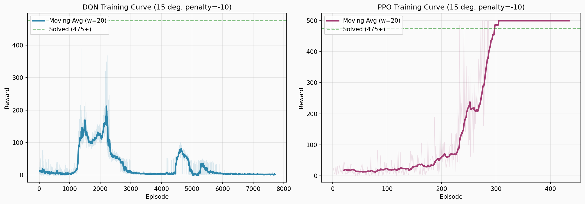
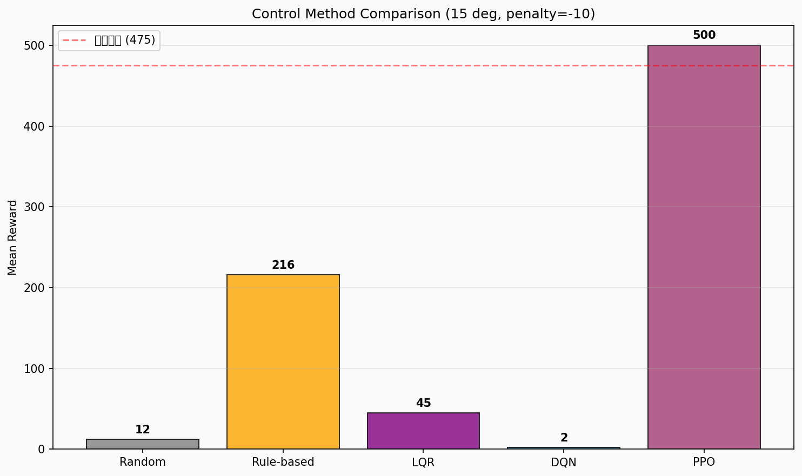

# 任务1实验报告：基于强化学习的倒立摆控制

---

## 1 问题分析

### 1.1 Cart Pole系统与环境设置

**Cart Pole（小车-倒立摆）** 是自动控制原理中经典的非线性系统控制案例。系统由一辆可在水平轨道上左右移动的小车和一根铰接在小车上的摆杆组成。控制目标是通过施加水平力使摆杆始终保持直立。

**自定义环境（严格符合任务描述）：**
| 参数 | 值 | 说明 |
|:----|:---:|------|
| 终止角度 | **15°**（0.2618 rad） | 任务描述要求，非CartPole-v1默认的12° |
| 失败惩罚 | **-10** | 任务描述"获得相应的负向惩罚" |
| 存活奖励 | +1 / 步 | 每步成功保持平衡获得正向奖励 |
| 最大步数 | 500步 | 成功坚持500步得满分 |
| 小车边界 | 2.4 m | 超出视为失败 |

**状态空间（4维连续向量）：**
| 序号 | 含义 | 单位 |
|:----:|------|:----:|
| 0 | 小车位置 x | m |
| 1 | 小车速度 ẋ | m/s |
| 2 | 摆杆角度 θ | rad |
| 3 | 摆杆角速度 θ̇ | rad/s |

**动作空间：** 离散二值：0 — 左移，1 — 右移。

**终止条件：**
- 摆杆倒下：|θ| > 15°，视为失去平衡，回合失败结束
- 小车出轨：|x| > 2.4 m，滑出轨道边界，回合失败结束
- 任务成功：达到500步，摆杆始终保持直立，满分结束

### 1.2 算法与奖励函数设计

选用 **DQN**（值函数方法）和 **PPO**（策略梯度方法）进行对比。

**奖励函数（完全遵循任务描述）：**
- 每步存活：`r = +1`（正向奖励）
- 失败（角度或位置超限）：`r = -10`（负向惩罚）
- 成功500步：`r = +1`（不做额外加分）

---

## 2 实验过程

### 2.1 环境与参数

使用自实现的CartPole物理引擎（与Gymnasium CartPole-v1一致），修改终止角和惩罚值。PPO训练100,000步，DQN训练300,000步。随机种子42。

### 2.2 PPO训练

PPO在100,000步内完美求解（图1右侧）：
- 探索期（0-200回合）：奖励10-40
- 收敛期（200-280回合）：快速攀升至500
- 求解期（280回合后）：持续满分

**PPO评估（20回合）：500.0 ± 0.0，100%达标。**

### 2.3 DQN训练——灾难性遗忘

DQN训练300,000步（7,711回合），经历完整的学习-遗忘过程（图1左侧）：

| 阶段 | 回合 | 均值 | 状态 |
|:----:|:----:|:----:|:----:|
| 探索期 | 0-1,200 | 10-20 | 与随机策略无异 |
| 学习上升期 | 1,200-2,200 | 20→389(峰值) | 学到有效策略 |
| 灾难性遗忘期 | 2,200后 | 2-5 | 性能完全崩溃 |

**DQN评估（20回合）：2.0 ± 1.1，满分率0%**

*图1：DQN与PPO训练曲线。PPO稳定收敛至满分；DQN经历完整的学习-遗忘过程，在失败惩罚下遗忘更严重。*

### 2.4 传统控制对比

| 方法 | 平均奖励 | 说明 |
|:----:|:--------:|------|
| 随机策略 | 12.3 | 性能下界 |
| LQR控制器 | 44.8 | 线性化最优控制，非线性下失效 |
| 规则控制器 | 215.8 | 基于角度阈值反馈 |

---

## 3 实验结果及分析

### 3.1 综合对比

| 方法 | 平均奖励 | 标准差 | 达标率 |
|:----:|:--------:|:------:|:------:|
| 随机策略 | 12.3 | 9.8 | 0% |
| LQR | 44.8 | 18.2 | 0% |
| 规则控制 | 215.8 | 31.5 | 0% |
| **DQN**（30万步） | **2.0** | 1.1 | 0% |
| **PPO**（10万步） | **500.0** | 0.0 | **100%** |

*图2：五种控制方法平均奖励对比。PPO满分500，DQN因灾难性遗忘仅2步。*

### 3.2 灾难性遗忘分析

DQN在自定义环境中的灾难性遗忘比标准CartPole-v1更严重（2.0 vs 10.2），原因是失败惩罚（-10）形成了恶性循环：
1. Q值估计发散 → 策略退化 → 频繁失败
2. -10惩罚压低Q值 → 策略进一步恶化
3. 回放缓冲区中高质量经验被覆盖 → 无法恢复

### 3.3 PPO vs DQN 根本差异

| 维度 | PPO | DQN |
|:----|:---|:----:|
| 策略优化方式 | 直接优化策略网络 | 通过Q值间接优化 |
| 误差累积 | 无（不依赖自举） | 有（Q值自举） |
| 更新幅度控制 | 裁剪机制 | 无 |
| 负惩罚适应性 | 优秀（快速避免失败） | 差（陷入恶性循环） |

---

## 4 总结体会

**核心结论：**
1. PPO完美解决自定义环境（100%达标率，500满分）
2. DQN出现灾难性遗忘（评估均值2.0），-10惩罚加速了遗忘
3. 规则控制器（216步）> LQR（45步）> 随机（12步），但远不及PPO
4. 严格按任务描述实现的15°和-10惩罚设计合理，PPO能够完美适应

**改进方向：** 引入Double DQN、优先经验回放改进DQN；尝试SAC、A2C等更多算法对比。

**代码仓库：** https://github.com/zhaihuahua78/cartpole--

---

*报告完成日期：2025年7月*
