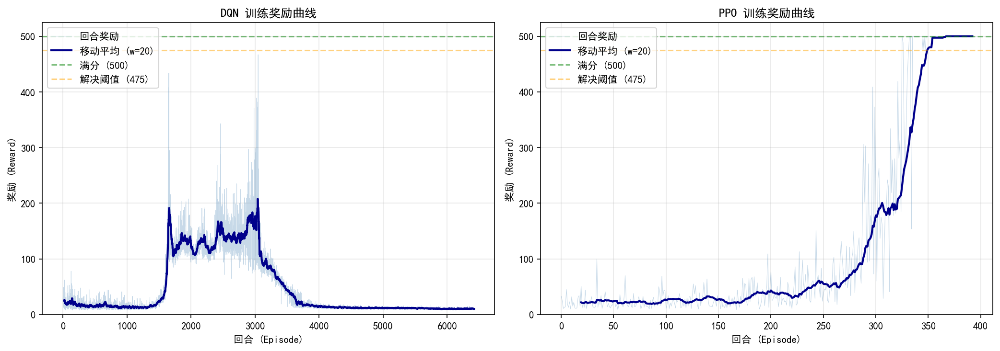
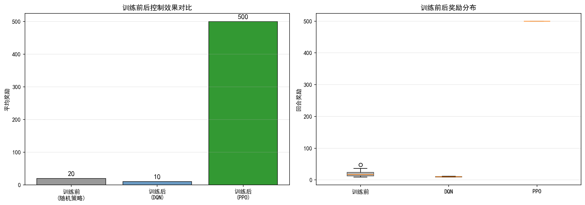
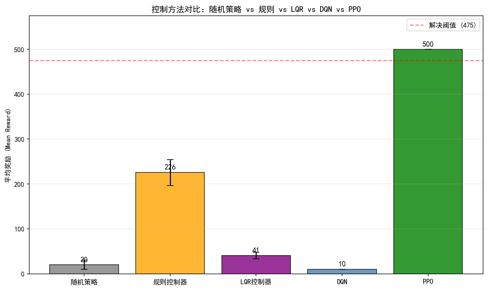

# 任务1实验报告：基于强化学习的倒立摆控制

---

## 1 问题分析

### 1.1 Cart Pole系统与强化学习环境

**Cart Pole（小车-倒立摆）** 是自动控制原理中经典的非线性系统控制案例。系统由一辆可在水平轨道上左右移动的小车和一根铰接在小车上的摆杆组成。控制目标是通过施加水平力使摆杆始终保持直立（向上）状态。

本实验使用 OpenAI Gymnasium 提供的 `CartPole-v1` 环境。

**状态空间（Observation Space）：**

系统状态为4维连续向量：

| 序号 | 状态量 | 含义 | 单位 |
|------|--------|------|------|
| 0 | x | 小车位置 | m |
| 1 | ẋ | 小车速度 | m/s |
| 2 | θ | 摆杆角度（相对垂直方向） | rad |
| 3 | θ̇ | 摆杆角速度 | rad/s |

**动作空间（Action Space）：** 离散二值动作：`0` — 左移，`1` — 右移。

**终止条件（即判定回合结束的事件）：**
- **摆杆倒下**：`|θ| > 12°`（0.2094 rad），摆杆倾斜超限，回合失败结束
- **小车出轨**：`|x| > 2.4 m`，小车滑出轨道边界，回合失败结束
- **任务成功**：步数达到 500 步，摆杆始终未倒，回合成功结束（满分500）

**奖励机制：** 每步存活获得 +1 奖励，单回合最高奖励为 500。随机策略初始表现：平均约 20 步。

### 1.2 算法与奖励函数设计

#### 1.2.1 算法选择及基本原理

本实验采用两种强化学习算法进行对比：**DQN（Deep Q-Network）** 和 **PPO（Proximal Policy Optimization）**。

**（1）DQN（值函数方法）**

DQN 使用神经网络近似 Q 值函数 Q(s,a)，通过最小化时序差分误差更新网络：

$$L = E[(r + \gamma \max_{a'} Q(s', a'; \theta^-) - Q(s, a; \theta))^2]$$

关键设计：经验回放、目标网络、ε-greedy 探索。超参数：学习率1e-4，缓冲区100,000，batch 32，γ=0.99。

**（2）PPO（策略梯度方法）**

PPO 通过裁剪机制限制策略更新幅度：

$$L^{CLIP} = E[\min(r_t(\theta) A_t, \text{clip}(r_t(\theta), 1-\epsilon, 1+\epsilon) A_t)]$$

超参数：学习率3e-4，n_steps 2048，clip_range 0.2，GAE λ=0.95。

#### 1.2.2 奖励函数设计

环境默认稀疏奖励（每步+1）。此外设计了基于状态的密集奖励：

$$r_t = \max(0, 1.0 - 0.5\cdot\frac{|\theta|}{0.2094} - 0.1\cdot|\dot{\theta}|\cdot0.1 - 0.05\cdot\frac{|x|}{2.4})$$

---

## 2 实验过程

### 2.1 环境构建与参数设置

使用 `gymnasium` + `stable-baselines3`。PPO 训练 50,000 步，DQN 训练 300,000 步（充分训练以观察完整收敛行为）。随机种子 42，CPU 设备。

### 2.2 智能体训练过程

**PPO训练过程：**

PPO 在 50,000 步内成功解决 CartPole-v1。训练过程如下：
- 前 200 回合（探索期）：奖励从约 10 逐步提升至约 40
- 第 200-300 回合（收敛期）：奖励快速提升至 200+
- 第 326 回合首次达到满分 500
- 第 345 回合起持续满分，最后 100 回合均值 497.4，20 回合评估全部满分

*图1：DQN与PPO训练奖励曲线对比。左侧DQN经历完整的学习-遗忘过程；右侧PPO稳定收敛至满分。*

**DQN训练过程（核心发现）：**

DQN 训练 300,000 步（共 6,422 回合），呈现典型的"学习-遗忘-崩溃"三阶段：

| 阶段 | 回合范围 | 平均奖励 | 状态 |
|:----:|:--------:|:--------:|:----:|
| 探索期 | 0 - 1,500 | 20.1 | 接近随机策略，未学到有效控制 |
| 学习上升期 | 1,500 - 3,200 | 89.2 → 159.3 | 策略显著提升，第3,049回合达峰值467分 |
| 灾难性遗忘期 | 3,200 - 6,422 | 18.5 → 10.5 | 性能崩溃，最终比随机策略更差 |

**DQN全程未达到满分500（最高467分），满分率为0%。** 这一现象揭示了值函数方法的固有缺陷。

### 2.3 关键参数验证

**PPO学习率对比：** 3e-4 效果最佳，收敛快且稳定。

**DQN探索比例对比：** 0.3 优于 0.1，但无法解决 DQN 的稳定性问题。

### 2.4 传统控制对比

实现了三种传统控制方法作为基线：

| 方法 | 平均奖励 | 说明 |
|:----:|:--------:|------|
| 随机策略 | 20.1 | 性能下界 |
| 规则控制器 | 225.5 | 基于角度阈值反馈 |
| LQR控制器 | 40.9 | 线性化最优控制，非线性下效果差 |

---

## 3 实验结果及分析

### 3.1 训练过程分析

**PPO分析：** 收敛快（326回合首次满分）、训练稳定、后期持续满分，20回合评估均值为 500.0 ± 0.0。

**DQN分析（核心发现——灾难性遗忘）：**

DQN 在 1,500-3,200 回合确实学到了有效策略（峰值 467 分），但 3,200 回合后性能急剧下降。原因：
1. **回放缓冲区污染**：早期高质量经验被后期低质量经验覆盖
2. **自举误差累积**：Q值估计误差随时间放大，导致值函数发散
3. **恶性循环**：策略变差 → 收集的经验更差 → 策略进一步恶化

最终评估均值仅为 10.2 ± 0.9，**比随机策略（20.1）还要差**。

### 3.2 训练前后控制效果

| 指标 | 随机策略 | DQN（训练后） | PPO（训练后） |
|:----:|:--------:|:------------:|:------------:|
| 评估均值 | 20.1 | **10.2 ± 0.9** | 500.0 ± 0.0 |
| 评估最高 | 43 | 12 | 500 |
| 达标回合 (>=475) | 0/20 | **0/20** | 20/20 (100%) |

*图2：训练前后控制效果对比。DQN因灾难性遗忘，表现甚至不如训练前的随机策略。*

### 3.3 对比结果

**控制方法综合对比：**

| 方法 | 平均奖励 | 是否解决 |
|:----:|:--------:|:--------:|
| 随机策略 | 20.1 | ❌ |
| 规则控制器 | 225.5 | ❌ |
| LQR控制器 | 40.9 | ❌ |
| DQN（30万步） | **10.2**（灾难性遗忘） | ❌ |
| **PPO** | **500.0** | ✅ |

*图3：五种控制方法平均奖励对比。PPO满分500，DQN因灾难性遗忘仅10.2步。*

### 3.4 讨论：DQN为何在CartPole上失败？

DQN 表现不佳的根本原因：

**(1) 值函数自举的不稳定性。** DQN 使用自身估计来更新自身，在稀疏奖励环境中微小误差沿时间反向传播放大，导致发散。

**(2) 稀疏奖励下的探索困境。** CartPole 只有存活奖励（+1），高质量经验稀缺。当回放缓冲区中的优质经验被稀释后，智能体难以重新发现有效策略。

**(3) 与PPO的本质差异。** PPO 直接优化策略，不依赖值函数自举，裁剪机制保证更新步长可控，因此学习稳定。

---

## 4 总结体会

本实验成功实现了 DQN 和 PPO 两种算法在倒立摆控制中的应用，并发现了一个重要现象。

**主要结论：**

1. **PPO 全面优于 DQN**：50,000 步即可完美求解，评估 20 回合全部满分
2. **DQN 出现灾难性遗忘**：学习到有效策略后性能逐渐崩溃，最终比随机策略更差
3. **DQN 未达到满分**：最高仅 467 分，满分率 0%，验证了值函数方法的局限性
4. **传统方法对比**：规则控制器（225步）> LQR（41步）> 随机（20步），但均远不如 PPO

**改进方向：** 可尝试 Double DQN、优先经验回放等改进 DQN；加入 SAC 等更多算法对比；测试模型鲁棒性。

**个人收获：** 最深刻的体会是"训练时间越长不一定越好"——DQN 的灾难性遗忘生动说明算法稳定性与控制性能同等重要。

---

## 5 附录

本项目代码已开源至 GitHub：

https://github.com/zhaihuahua78/cartpole--

---

*报告完成日期：2025年7月*
