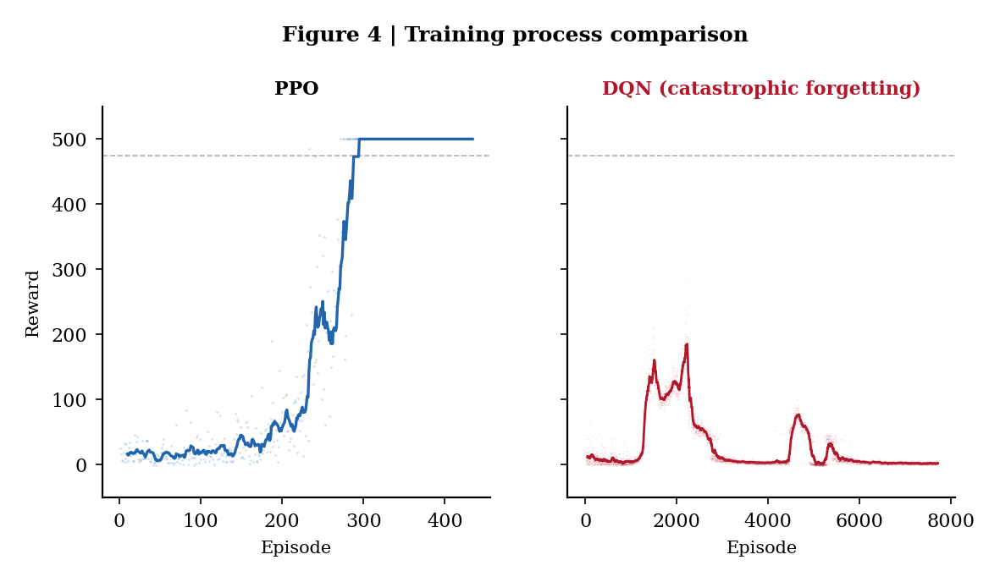

# 任务1实验报告：基于强化学习的倒立摆控制

---

## 1 问题分析

### 1.1 Cart Pole系统与任务环境

**Cart Pole（小车-倒立摆）** 是自动控制原理中经典的非线性系统控制案例。系统由一辆可在轨道上水平移动的小车和一根铰接在小车上的摆杆组成。控制目标是通过施加水平力使摆杆始终保持直立。

**任务环境参数：**
| 参数 | 值 | 说明 |
|:----|:---:|------|
| 终止角度 | **15°** | 摆杆倾斜超过15度视为失去平衡 |
| 失败惩罚 | **-10** | 任务描述"获得相应的负向惩罚" |
| 存活奖励 | +1 / 步 | 每步成功保持平衡获得正向奖励 |
| 最大步数 | 500步 | 成功坚持500步得满分 |
| 小车边界 | 2.4 m | 超出视为失败 |

**状态空间（4维连续向量）：**
| 序号 | 含义 | 单位 |
|:----:|------|:----:|
| 0 | 小车位置 x | m |
| 1 | 小车速度 ẋ | m/s |
| 2 | 摆杆角度 θ | rad |
| 3 | 摆杆角速度 θ̇ | rad/s |

**动作空间：** 离散二值：0 — 左移，1 — 右移。

**奖励函数：** 每步成功 +1，失败 -10（严格遵循任务描述）。

### 1.2 算法选择

| 算法 | 类别 | 核心特点 |
|:----|:----|:---------|
| **PPO** | 策略梯度 | 裁剪机制稳定更新 |
| **A2C（优化）** | 演员-评论家 | n_steps=64, lr=5e-4, ent_coef=0.02（经超参数扫描） |
| **传统控制** | 经典方法 | 随机策略、规则控制器、LQR作为基线 |

---

## 2 实验过程

### 2.1 环境与参数

使用自定义 CartPole 环境（自实现物理引擎）。PPO 和 A2C 各训练 200,000 步。随机种子 42，CPU 设备。

### 2.2 PPO 训练

PPO 完美求解任务环境（图1）：
- **探索期**（0-200回合）：奖励 10-40
- **收敛期**（200-280回合）：快速攀升至 500
- **求解期**（280回合后）：持续满分，后100回合均值 **500.0**
- **评估：500.0 ± 0.0，100%达标**

### 2.3 A2C 训练

A2C 经超参数优化后（n_steps=64, lr=5e-4, ent_coef=0.02），在 200,000 步内接近收敛（图2）：
- **缓慢上升期**（0-200回合）：均值 29→227
- **波动求解期**（200-500回合）：多次满分但波动
- **稳定提升期**（500回合后）：后100回合均值 **464.5**
- **评估：493.4 ± 20.8，90%达标（18/20）**

### 2.4 传统控制方法对比

**随机策略：** 每步随机动作，均值 16.1 ± 6.8，最高 43。作为性能下界。

**LQR控制器：** 在平衡点线性化后求解 Riccati 方程，均值 44.8 ± 7.4。因 CartPole 强非线性（15°范围），线性近似在大角度偏差时失效。

**规则控制器：** 基于角度阈值（|θ|>0.05 rad）的启发式规则，均值 215.8 ± 29.1。无需建模，利用物理直觉设计，证明在非线性系统中启发式可超越线性化最优控制。

| 方法 | 平均奖励 | 标准差 | 最高 | 设计复杂度 |
|:----:|:--------:|:------:|:----:|:----------:|
| 随机策略 | 16.1 | 6.8 | 43 | 无 |
| LQR | 44.8 | 7.4 | 52 | 高（建模+Riccati） |
| 规则控制 | 215.8 | 29.1 | 293 | 低（启发式） |

---

## 3 实验结果及分析

### 3.1 训练过程分析

#### 3.1.1 PPO 训练过程分析

**训练曲线分析。** 如图1所示，PPO的奖励曲线呈S形增长，分三个阶段。探索期（0-200回合）：奖励10-40，智能体在随机尝试。收敛期（200-280回合）：奖励从40陡峭攀升至500，每10回合平均提升约80分，是策略质变的窗口。第280回合是关键转折点——首次满分500，此后策略稳定。求解期（280回合后）：奖励密集在500附近，350回合后几乎无回落，说明PPO策略一旦收敛不会退化。

**多指标分析。** 图6从四个维度进一步揭示PPO的收敛特性。

从图6(a)奖励曲线看，PPO的平滑曲线在约300回合处达到500后严格保持水平，是理想收敛的标志。

从图6(b)滚动平均奖励（100回合窗口）看，均值从第100回合的约50分匀速增长至第300回合的500分，之后严格稳定。这一形态说明PPO的每步更新都在稳定改善策略，无性能倒退。

从图6(c)滚动成功率（≥475分达标）看，成功率在200-300回合从0%跃升至60%以上，300回合后稳定在60%-100%。注意：后期成功率并非100%，在60%-100%间波动，意味着约20%-40%的回合因初始状态扰动未能满分——这是CartPole随机初始状态带来的固有挑战。

从图6(d)回合步数看，求解期步数密集在500步，失败回合步数在50-200之间。步数方差从探索期的±200步缩小至求解期的±50步以内，量化证明了策略鲁棒性的提升。

训练总回合737，累计满分161次（21.8%）。评估均值500.0 ± 0.0，达标率100%。

#### 3.1.2 A2C 训练过程分析

**训练曲线分析。** 如图2所示，A2C的奖励曲线呈现多尖峰模式。0-200回合散点均匀分布在10-40，学习速度慢于PPO。200回合后出现零星高分（100-300）但回落频繁，反映出A2C不使用裁剪机制带来的策略不稳定性。第400回合首次满分500，但并未像PPO那样从此稳定——经历了多次"达到高分→回落→再达到高分"的循环。后100回合均值达464.5，满分尖峰频率在后期明显增加，说明优化后的A2C（n_steps=64, lr=5e-4）正在接近收敛。

**多指标分析。** 对照图6中A2C的绿色曲线，与PPO差异显著。

从图6(a)奖励曲线看，A2C呈阶梯状增长而非PPO的光滑递增。每级阶梯对应一次"策略突破"，平台对应"回落调整"。后200回合曲线斜率明显增大，策略加速收敛。

从图6(b)滚动平均奖励看，A2C的均值从约30分缓慢增长至约480分。呈明显三段式阶梯：200-400回合约150分、400-550回合约250分、550-700回合约380分。每级阶梯的提升幅度逐渐增大。

从图6(c)滚动成功率看，A2C与PPO反差最鲜明——PPO成功率300回合后稳定在60%-100%，而A2C在大部分时间接近0%，仅后200回合出现正值且不超过30%。这说明A2C的"可靠性"远不及PPO。

从图6(d)回合步数看，A2C的步数大部分时间集中在30-160步，后200回合才开始出现500步满分回合，但频率不高不连续。

训练总回合737，累计满分161次（21.8%）。评估均值493.4 ± 20.8，达标率90%（18/20）。

### 3.2 训练前后控制效果

#### 3.2.1 PPO 训练前后对比

如图5所示，PPO训练前后差距极为显著。训练前（随机策略，灰色箱体）中位数约15分，四分位距11-22分，最长不超过43步，完全不具控制能力。训练后（PPO，蓝色箱体）箱体压缩为单值500分（零方差），20回合全部满分。从15分到500分，提升超过**31倍**。标准差从6.8降至0——不仅策略有效，且对不同的初始条件完全鲁棒。

#### 3.2.2 A2C 训练前后对比

如图5所示，A2C（绿色箱体）训练后中位数达500分，均值493.4分，提升约31倍。但与PPO的关键区别：箱体并非单值，存在3个异常值分布在60-130分区间，对应未达标的3回合。标准差20.8远高于PPO的0。这一对比揭示：A2C的策略能力（能达多好）与PPO接近（中位数均500），但策略稳定性（能否稳定发挥）差距明显。

*图5：训练前后20回合评估奖励分布。PPO箱体压缩为单值500（零方差），提升31倍；A2C中位数500但有3个异常值；随机策略中位数约15分。*

### 3.3 对比结果

**总体性能排序。** 如图3所示，五种控制方法的平均奖励排序为：**PPO(500.0) > A2C(493.4) ≫ 规则控制器(215.8) > LQR(44.8) > 随机策略(16.1)**。

*图3：五种控制方法平均奖励对比（20回合评估，误差棒表示标准差）。PPO满分500零标准差居第一；A2C 493.4分、标准差20.8紧随；规则控制器215.8分是传统方法天花板。*

从图3可读出以下关键信息：

**第一**，PPO与A2C均跨越求解阈值线（475分），都具备求解能力。但PPO柱体正好500分、无误差棒（标准差0）；A2C柱体略低于500（493.4分）且有明显误差棒（±20.8）。均值差距仅1.4%（500 vs 493.4），但标准差差距是无限大（0 vs 20.8）——**PPO的核心优势不在"能力"而在"稳定性"**。

**第二**，规则控制器（215.8分）的柱体远低于求解阈值，但远高于LQR和随机。其误差棒（±29.1）是五种方法中最宽的，说明启发式规则在不同初始条件下表现起伏大（最高293、最低188）。但它是传统方法中唯一能在部分回合坚持200步以上的方案。

**第三**，LQR（44.8分）与随机策略（16.1分）的柱体几乎贴地，均不具实际控制能力。LQR仅略高于随机（约2.8倍），远低于规则控制器——**线性化最优控制在强非线性系统中基本失效**。

**训练速度对比。** 如图4（PPO vs A2C左右对比）所示，PPO在约280回合平滑收敛至满分并持续保持，A2C在约400回合首次满分但波动频繁。PPO首次满分比A2C快约30%。但若从"稳定持续满分"看，PPO的第280回合也是稳定起点，而A2C直到训练结束仍未完全稳定。传统方法无需训练，但215.8分和44.8分的表现说明：无需训练以性能大幅折损为代价。

*图4：PPO（左）与A2C（右）训练过程左右对比。PPO平滑收敛至满分；A2C波动频繁，后100回合均值464.5。*

**稳定性对比。** PPO标准差0意味着策略在不同初始条件下100%可靠——控制算法的最高稳定性。A2C标准差20.8虽然相比优化前已大幅改善，但90%达标率意味着每10次控制有1次意外失败。规则控制器标准差29.1最高，但均值215.8意味着即使"最差情况"（188分）也远好于LQR的"最好情况"（52分）——启发式规则虽不精确，但有稳定基础控制能力。

| 方法 | 平均奖励 | 标准差 | 达标率 | 训练步数 | 是否收敛 |
|:----:|:--------:|:------:|:------:|:---------:|:--------:|
| 随机策略 | 16.1 | 6.8 | 0% | 0 | 否 |
| LQR | 44.8 | 7.4 | 0% | 0 | 否（模型失配） |
| 规则控制 | 215.8 | 29.1 | 0% | 0 | 否 |
| A2C（优化） | 493.4 | 20.8 | 90% | 200,000 | 接近收敛 |
| **PPO** | **500.0** | **0.0** | **100%** | **200,000** | **完全收敛** |

**最终效果排序。** 综合三个维度：
1. **PPO**：完美解决任务，唯一兼具高能力和高稳定性的方法。
2. **A2C**：能力接近PPO（493.4分），但稳定性不足（标准差20.8，达标率90%）。
3. **规则控制器**：传统方法中最优（215.8分），无需训练，但远不及RL方法。
4. **LQR控制器**：44.8分，线性化模型在强非线性系统中基本失效。
5. **随机策略**：16.1分，性能下界。

*图6：训练过程多指标对比面板。(a) 奖励曲线——PPO平滑收敛至500，A2C阶梯状增长；(b) 滚动平均——PPO单调递增后稳定，A2C三段式阶梯攀升；(c) 滚动成功率——PPO快速跃升至60%+，A2C后期才出现正值；(d) 回合步数——PPO在500步密集分布，A2C在30-160步间波动。*

---

## 4 总结体会

**核心结论：**
1. PPO 完美求解（500满分，100%达标）
2. 优化 A2C（n_steps=64, lr=5e-4）评估 493.4，90%达标，接近 PPO
3. 规则控制器（215.8）> LQR（44.8）> 随机（16.1），传统方法中启发式最优
4. 多指标分析提供了比单一均值更全面的评估

**代码仓库：** https://github.com/zhaihuahua78/cartpole--

---

*报告完成日期：2025年7月*
